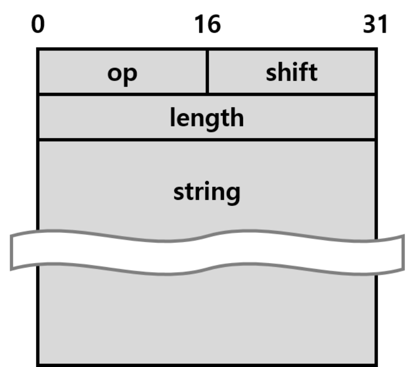

# C Socket Program

This is a sample program for the socket programming using in C Language, by sending a command user input in the CLI to tell what the server need to do, and then the server do the correspond actions and then return to the client.

## The Structure of the Application Layer
This program is asked to design an application protocol to transport the data, here is the diagram:



- `op field`: This field takes the first 16 bits. It denotes the operation type of the request. If this field is 0, it means encryption. If this field is 1, it means decryption.
- `shift field`: This field takes the next 16 bits. It denotes the number of shifts (the value of n). The shift value is between 0~65535.
- `length field`: This field takes the next 32 bits. The value of this field denotes the total length of a message, including ‘op’, ‘shift’, ‘length’ field itself, and ‘payload’(‘string’) portion. The unit of this field is in ‘bytes’, not ‘bits’. Also, this field should be in network order.
- `string field`: The size of this field is variable and is determined by the value in the ‘length’ field. It contains the string we want to encrypt/decrypt.
## Usage
Here is the structure of the project:
```txt
.
├── Makefile
├── README.md
├── client
│   ├── ArgumentParser.c
│   ├── ArgumentParser.h
│   ├── Caesar.c
│   ├── Caesar.h
│   ├── Makefile
│   ├── PayloadProcess.c
│   ├── PayloadProcess.h
│   ├── Serialization.c
│   ├── Serialization.h
│   └── main.c
├── img
│   └── img.png
└── server
    ├── ArgumentParser.c
    ├── ArgumentParser.h
    ├── Caesar.c
    ├── Caesar.h
    ├── Makefile
    ├── Makefile2
    ├── PayloadProcess.c
    ├── PayloadProcess.h
    ├── Serialization.c
    ├── Serialization.h
    └── main.c
```
If you want to build the program `server.out` and `client.out`, just run the following command in your CLI:
```commandline
make all
```
in the root path, this will automatically run the `make` instruction to build the two program: `server.out` and `client.out`

## How to run the program
After building, to run the two program, just enter the following command in your CLI:
```bash
./server.out -p [port number]  # run the server program
```
Here is the argument explanation of the `server.out`
- `-p`: which port the program want to listen

To run the `client.out`, you should enter:
```bash
./client.out -h [host address] -p [port number] -o [op code] -s [shift number]
```
Here is the argument explanation of the `client.out`:
- `-h`: which host address does the client program wants to access
- `-p`: which port the program want to connect
- `-o`: which action does the server will take `1` for decryption, `0` for encryption
- `-s`: how many bits does the server will shift (0 ~ 65535)

